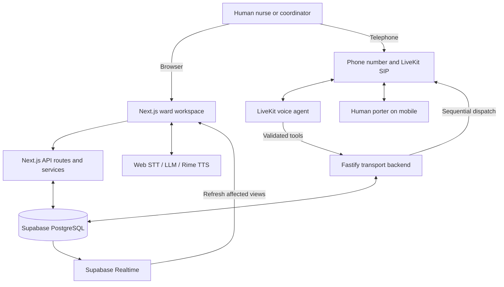
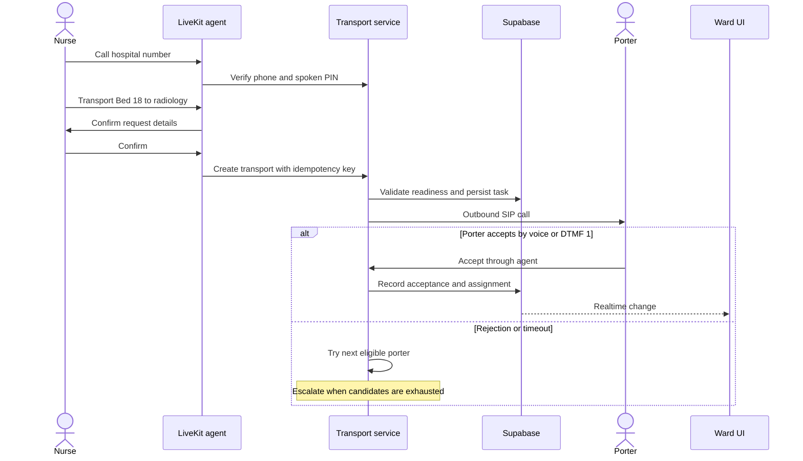
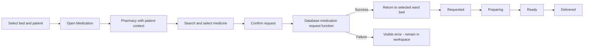
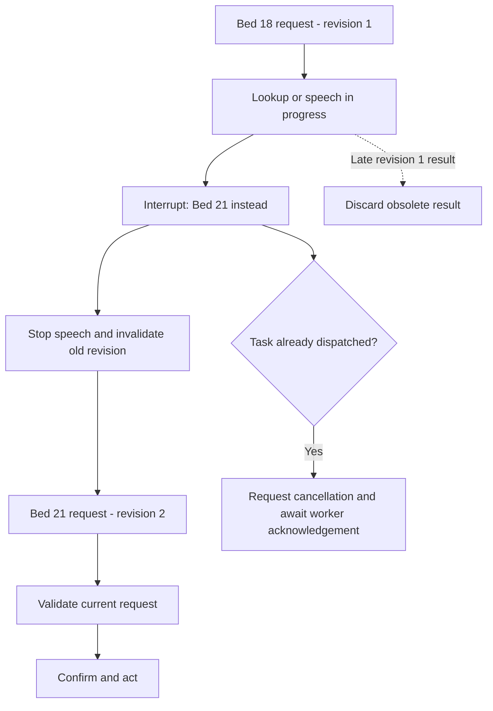

<div align="center">

# Warden

### A live ward. A shared picture. One voice to coordinate it.

Voice-first hospital operations for nurses, ward coordinators, and support staff.

[Live prototype](https://warden-eight-theta.vercel.app/) · [Quick start](#quick-start) · [Architecture](#architecture) · [Telephone backend](backend/README.md) · [Voice evidence](backend/RIME_EVIDENCE.md)

**Next.js 16 · React 19 · TypeScript · Supabase · LiveKit · Rime**

</div>


https://github.com/user-attachments/assets/1a193ce6-6e66-4c79-8759-0eebb3918ed3

*Ward scene asset used by the interactive prototype. Live overlays and controls are rendered by the application.*

## Why Warden?

A phone call can request a porter. It cannot, by itself, give every nurse a shared record of who accepted, which bed is waiting, or what changed while they were speaking.

Warden connects those steps. Its central idea is a **live operational twin of the ward**: beds, patients, tasks, staff, and dependencies should explain what is happening together. The ward is the primary workspace; pharmacy and supporting panels retain the surrounding operational context.

Built for the Rime voice AI hackathon, Warden uses synthetic hospital data. It coordinates work; it does not diagnose patients or recommend treatment. Nurses, coordinators, and porters are human users. Warden is the AI assistant.

## Explore the prototype

| Workspace | What you can do |
| --- | --- |
| **General ward** | Select beds, inspect patient context and operational tasks, change floors, and use inspection lighting. |
| **Medication workspace** | Open pharmacy from a patient, search the inventory, select medication, and submit a patient-bound request. |
| **Staff and tasks** | Inspect availability, workload, task ownership, and blockers. |
| **Admissions** | Review incoming patients, arrival estimates, readiness blockers, and bed reservations. |
| **Voice** | Speak through supported browser input and receive configured provider audio, including Rime. |
| **Supporting panels** | Inspect inter-ward messages, deferred work, print requests, and estimated energy usage. |
| **Food inventory** | Search database-backed nutrition inventory and inspect the matching item. |

**Current boundaries:** the campus map is a reference view, energy history is modelled, and animations are not evidence of connected medical sensors or hardware. The patient-call panel is an explicitly gated simulation, separate from the standalone telephone transport backend.

## Architecture

The repository contains two applications. The Next.js dashboard serves its own API routes. The persistent Fastify backend and LiveKit agent handle telephone transport coordination. In live mode, Supabase connects their operational records.



Provider interfaces live in [`backend/src/ports`](backend/src/ports). Repository, telephony, and speech adapters sit outside transport business rules. The LiveKit agent composes its speech session separately, so replacing a provider can require both an adapter and session configuration changes.

### Telephone transport flow

This is the implemented backend flow; real carrier delivery and timing still require a deployed verification run.



A created request, a dispatched call, an accepted assignment, and completed transport are different states. An acknowledgement must come from the worker; starting a call is not acceptance.

### Contextual medication flow



The database request is attached to the patient, bed, medication, and task. Later stages require workflow transitions; they do not complete automatically because an animation finished.

### Interruption handling

The telephone/backend coordination logic tracks operation revisions so late work cannot become a new action after an interruption.



Automated tests cover stale-result rejection and audio fencing. **The 500 ms audible interruption target is not yet a measured live-call result.** See the [evidence ledger](backend/RIME_EVIDENCE.md).

## Quick start

Use a current Node.js LTS release compatible with Next.js 16 and the LiveKit Node packages, npm, and a Supabase project. Node.js 22 is a practical starting point. Live phone calls additionally need LiveKit and a compatible SIP provider.

### 1. Clone and install

```bash
git clone https://github.com/Abhinav-Prabhakar/Warden.git
cd Warden
npm ci
cp .env.example .env.local
```

### 2. Configure the web app

Fill in `.env.local` with your own values:

```dotenv
NEXT_PUBLIC_SUPABASE_URL=https://YOUR_PROJECT.supabase.co
NEXT_PUBLIC_SUPABASE_ANON_KEY=YOUR_ANON_KEY
SUPABASE_SERVICE_ROLE_KEY=YOUR_SERVICE_ROLE_KEY

# Web voice providers
GROQ_API_KEY=YOUR_GROQ_KEY
RIME_API_KEY=YOUR_RIME_KEY
```

Keep service credentials on the server. The prototype also exposes browser voice settings and persists entered keys in local storage; use server configuration for a shared demo and do not enter service-role or infrastructure secrets into a shared browser.

### 3. Apply the database schema

For a linked Supabase project:

```bash
npx supabase login
npx supabase link --project-ref YOUR_PROJECT_REF
npx supabase db push
```

Review pending migrations before applying them to an existing database. The root [`supabase/migrations`](supabase/migrations) directory contains the base schema, telephone additions, unified transport operations, medication requests, and nutrition inventory.

For a fresh demo database, run [`supabase/seed.sql`](supabase/seed.sql) in the Supabase SQL Editor **after the migrations**. Review [`backend/supabase/seed.sql`](backend/supabase/seed.sql) if you also need the telephone demo identities. Seed files contain synthetic fixtures and should not be applied to real hospital records.

### 4. Start the dashboard

```bash
npm run dev
```

Open **[localhost:3000](http://localhost:3000)**. Database errors are displayed when credentials or tables are missing; the dashboard does not become an in-memory ward automatically.

### 5. Try a patient workflow

1. Select an occupied bed and inspect its patient context.
2. Open Medication to enter pharmacy for that patient.
3. Search for an available medicine and confirm the request.
4. Verify the same bed shows the request after returning to the ward.
5. Click the voice orb to start voice input; hold it for **2.5 seconds** to open provider settings.

Browser speech recognition depends on browser support and microphone permissions. Use a supported browser such as Chrome for the demo. Rime is the default web speech output; provider errors are surfaced rather than silently replaced with browser speech. Previously saved voice settings can override the new defaults.

## Run the telephone backend

In a separate terminal:

```bash
cd backend
npm ci
cp .env.example .env
# Set API_AUTH_TOKEN to a random secret of at least 12 characters.
# For local browser access, set CORS_ORIGIN=http://localhost:3000.
npm run dev
```

The example explicitly sets `WARDEN_MODE=simulation`. This starts a fixture-backed API on **port 3100**, uses memory that resets on restart, and makes no real calls. It does not replace the dashboard's Supabase database.

```bash
curl http://localhost:3100/health
```

The health response identifies the active mode and storage. Simulation commands use `/api/local/chat`, `/api/local/interrupt`, and `/api/local/action`; protected routes require a bearer token.

### Enable real telephone coordination

Set these values in `backend/.env` or the service's server secrets:

| Variable | Purpose |
| --- | --- |
| `WARDEN_MODE=live` | Enable persistent repository and LiveKit telephony. |
| `API_AUTH_TOKEN` | Authenticate agent-to-backend requests. |
| `BACKEND_BASE_URL` | Reachable URL of the persistent backend. |
| `SUPABASE_URL`, `SUPABASE_SERVICE_ROLE_KEY` | Connect the shared database. |
| `LIVEKIT_URL`, `LIVEKIT_API_KEY`, `LIVEKIT_API_SECRET` | Connect LiveKit. |
| `LIVEKIT_SIP_OUTBOUND_TRUNK_ID` | Select the outbound SIP trunk. |
| `STT_PROVIDER=livekit-inference` | Use the configured LiveKit inference STT model. |
| `LLM_PROVIDER=livekit-inference` | Use the configured inference language model. |
| `TTS_PROVIDER=rime` | Explicitly select Rime for judging. |
| `TTS_MODEL=rime/mistv2`, `TTS_VOICE=abbie` | Configure the telephone voice. |

The telephone agent uses LiveKit Inference for its speech session; the web TTS endpoint uses a direct Rime API key. Configure access for both paths when demonstrating both.

Create an inbound SIP trunk and agent dispatch rule, then start the worker separately:

```bash
npm run agent
```

Deploy the Next.js application to Vercel, the Fastify API to a persistent Node host, and the voice worker to a compatible LiveKit Agents environment. A Vercel dashboard deployment alone does not start the telephone service or provision a phone number.

The separate web patient-call demo requires `WARDEN_ENABLE_CALL_SIMULATION=true` in the Next.js environment. Enabling it permits simulated calls; supplying LiveKit credentials does not turn that panel into a live dialler.

## API guide

| Application | Endpoint family | Responsibility |
| --- | --- | --- |
| Next.js | `/api/beds`, `/api/tasks`, `/api/ward/*` | Ward state, tasks, changes, and operational summaries. |
| Next.js | `/api/pharmacy`, `/api/medication-requests` | Inventory and patient-bound medication workflows. |
| Next.js | `/api/nutrition` | Nutrition inventory from Supabase. |
| Next.js | `/api/voice/chat`, `/api/voice/stt`, `/api/voice/tts` | Web voice provider requests. |
| Next.js | `/api/warden/*`, `/api/print-queue` | Supporting coordination panels and print records. |
| Fastify | `/api/tasks`, `/api/tasks/:id/*` | Telephone transport creation and lifecycle. |
| Fastify | `/api/dispatch/respond` | Worker acknowledgement from the agent. |
| Fastify | `/api/calls/livekit/webhook` | Signature-verified LiveKit events. |

The two applications have separate `/api/tasks` routes; use the correct host and port. See the [backend API guide](backend/README.md#api) for headers and idempotency requirements. The legacy web `/api/medications/order` endpoint returns `410`; use patient-bound medication requests.

## Verification and limits

```bash
# Dashboard
npx tsc --noEmit
npm run build
npm run lint

# Telephone backend
cd backend
npm test
npm run typecheck
npm run build
```

At the last recorded verification, the frontend production build and backend type-check/build passed. The backend suite passed **33 tests across 6 files**. Frontend lint still reports existing repository issues; there is no clean-lint claim.

| Area | Evidence / remaining work |
| --- | --- |
| Transport rules | Automated coverage for identity checks, readiness, duplicates, dispatch outcomes, cancellation, and HTTP authentication. |
| Interruption logic | Automated revision/audio fencing coverage; carrier audio timing remains unmeasured. |
| Database-backed UI | Requires applied migrations and valid Supabase credentials; production workflow verification must follow configuration. |
| Rime audio | Integration exists; successful audible output requires valid provider access. |
| Real inbound/outbound calls | Requires deployed backend, agent, SIP trunks, number, and live acceptance tests. |
| Public-demo security | Next.js route authorization is not uniformly enforced. This prototype is not ready for real patient data or unrestricted operational use. |
| Hardware and telemetry | Campus map, modelled energy, and queue/telemetry visuals do not prove physical device integration. |

## Repository map

```text
Warden/
├── app/                    Next.js ward UI, panels, and API routes
├── lib/
│   ├── services/           Ward, bed, task, print, and intelligence services
│   ├── realtime/          Supabase change subscriptions
│   └── voice/             Browser voice session and settings
├── backend/
│   ├── src/agent-entry.ts LiveKit voice worker
│   ├── src/api.ts         Fastify API
│   ├── src/workflow/      Transport orchestration
│   ├── src/conversation/  Conversation and revision control
│   ├── src/ports/         Provider interfaces
│   ├── src/adapters/      Provider implementations
│   ├── tests/             Backend verification
│   └── RIME_EVIDENCE.md   Measured results and pending live evidence
├── supabase/              Schema migrations and demo fixtures
├── scripts/               Additional seeding utilities
├── public/                Ward, pharmacy, food, and icon assets
└── types/                 Database types
```

## Contributing

Open an issue with the workflow you expected, what happened, and steps to reproduce. For changes, keep patient context intact, preserve the existing visual language, and verify the consequence across affected views. A success message must follow a successful state transition; simulations and estimates must remain visible as such.

Use synthetic data, keep secrets out of commits, and include relevant test results with your pull request. For voice changes, distinguish automated logic tests from measured audible behavior.

## License

MIT
